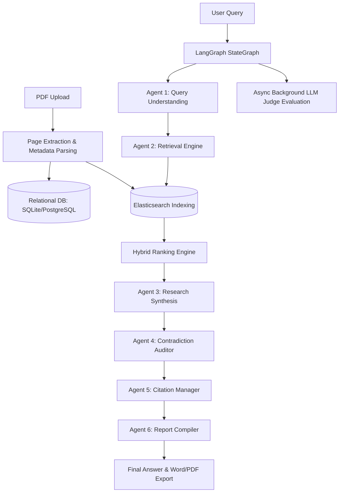

# PageRAG Interview Preparation Guide

This guide compiles comprehensive, production-grade answers to all interview questions related to the **PageRAG** project. Use this to prepare for technical, architectural, and conceptual discussions during your interviews.

---

## 1. Basic Questions

### Tell me about your PageRAG project.
**PageRAG** is a citation-aware, multi-agent research assistant designed to index, search, and synthesize insights from academic and research papers (PDFs). Unlike standard Retrieval-Augmented Generation (RAG) tools that return generic chunks of text, PageRAG indexes documents **strictly at the page level** to ensure clean, high-precision source citations.
It uses **FastAPI** for a lightweight, asynchronous API, **Elasticsearch** (with local **BM25** fallback) for text retrieval, and a **LangGraph-driven multi-agent workflow** to orchestrate query understanding, research synthesis, contradiction detection, and citation mapping. It also includes an asynchronous evaluation pipeline (using LLM-as-a-judge) that measures retrieval precision/recall, citation accuracy, and hallucination scores.

### Why did you build it?
Researching academic literature involves reading hundreds of pages of PDF articles. Traditional RAG systems often fail in academic workflows because:
1. They chunk text arbitrarily (e.g., 500-token chunks), destroying the document's original pagination. This makes verifying sources incredibly painful.
2. They do not rank papers based on scholarly relevance factors (like publication year or citation counts).
3. Single-prompt RAG agents struggle to synthesize cross-document contradictions or generate reliable, sequentially-numbered bibliography citations.
I built PageRAG to solve these specific gaps by creating a dedicated page-level index, applying a domain-specific hybrid ranking formula, and employing specialized agents in a stateful workflow.

### What problem does it solve?
1. **Citation Untrustworthiness (Hallucination of Sources):** It guarantees that every statement made in the synthesis is backed by a verifiable source (e.g. `[1]` mapping to a specific document and page number like `Page 12 of Paper X`).
2. **Context Fragmentation:** Traditional chunking splits sentences across chunks. Page-level extraction maintains the layout and contextual integrity of document pages.
3. **Information Overload and Conflicts:** It automatically highlights *contradictions* and differing viewpoints/methodologies between multiple research papers.
4. **Scholarly Authority Ranking:** Standard vector search is blind to metadata. Our system ranks pages by combining textual match with publication date, paper citations, and page positions.

### Explain it to a non-technical person.
Imagine you have a stack of 50 long research papers and you want to know: *"Does caffeine improve memory?"*
Instead of reading all of them, you give them to **PageRAG**.
1. It looks at every single page of these papers and indexes them in a digital library catalog.
2. When you ask your question, it doesn't just search for the word "memory"—it figures out exactly what you're asking, searches the catalog for the best pages, and filters them using other clues like: *Is this page from an influential paper? Is it a recent paper? Is it from the summary section or just a random footnote?*
3. It takes the best 4 or 5 pages and hands them to a team of specialized digital assistants:
   - **Assistant 1** reads the pages and drafts a summary, pointing to exactly which page it got each fact from.
   - **Assistant 2** double-checks the pages to see if two different scientists disagreed with each other.
   - **Assistant 3** tidies up the footnotes so they look like a clean academic bibliography (e.g., `[1]`, `[2]`).
4. Finally, it compiles a formatted report for you with a clear answer, an executive summary, list of contradictions, and a verified bibliography.

---

## 2. Architecture & Design Decisions

### The Architecture Pipeline
During the interview, draw this sequence flow to explain the system:

### Key Architectural Questions

#### Why FastAPI?
- **Asynchronous natively:** FastAPI is built on ASGI (uvicorn) and Starlette, making it highly efficient at handling concurrent, non-blocking I/O operations (like calling external LLM APIs or uploading large PDFs).
- **Fast Development & Typing:** It leverages Pydantic for data validation and automatically generates interactive OpenAPI/Swagger documentation (`/docs`), making it highly professional and easy to test.
- **Microservice friendly:** It keeps the web layer thin, allowing the heavy lifting to be delegated to background workers or services.

#### Why Elasticsearch?
- **Text Retrieval Powerhouse:** Elasticsearch is built on Apache Lucene and is the industry standard for full-text search. It handles tokenization, stemming, synonyms, and phrase matches natively.
- **Scaling:** It scales horizontally to millions of documents and pages.
- **Rich Query DSL:** It allows complex compound queries, filtering, and scoring configurations out-of-the-box.
- **BM25 Algorithm:** It implements BM25 natively, providing a highly optimized term frequency-inverse document frequency (TF-IDF) based relevance rank.

#### Why not Pinecone?
- **Pinecone is a closed-source, hosted vector database.** In research/academic projects, we often want complete control over data privacy, indexes, and infrastructure costs.
- **No Native BM25/Keyword Search support:** Pinecone is built strictly for dense vector embeddings. While it recently added hybrid search, it requires setting up separate sparse encoder models client-side. Elasticsearch handles full-text queries natively with zero overhead.
- **Data Latency/Cost:** Pinecone requires network calls to a cloud service for every operation, whereas Elasticsearch can be run in a local Docker container during development.

#### Why not FAISS?
- **FAISS (Facebook AI Similarity Search) is a library, not a database.** It lacks metadata indexing, transactional guarantees, document storage, dynamic updates, backups, and a multi-user API.
- If you delete a paper, removing vectors in FAISS is complicated because it uses raw array offsets. In Elasticsearch, we delete by query (`paper_id`) instantly.
- FAISS runs in-memory. For large-scale multi-user apps, it leads to memory bloat and lacks persistence.

#### Why LangGraph?
- **Stateful Multi-Agent Orchestration:** Standard LangChain is linear (chains). LangGraph allows us to define agents as a stateful graph where agents read from and write to a shared memory state (`ResearchState`).
- **Cyclic Graphs and Control Flow:** If synthesis fails validation, we can loop back to query expansion or retrieval.
- **Determinism:** It gives us structural control (e.g. sequence: Query -> Retrieval -> Synthesis -> Contradictions -> Citations -> Report) while letting LLMs handle the cognitive tasks at each node.

#### Why page indexing?
- **Pagination Integrity:** Academic papers are referenced by page numbers. By storing text per page, our citations (e.g. `Doc1_P5`) map to physical pages, making it trivial for researchers to verify statements.
- **Logical Chunks:** A page is a natural, human-authored chunk (usually 300–600 words). Unlike arbitrary character or token splitting, pages represent cohesive paragraphs and arguments.

#### Why hybrid search?
- Standard vector search is blind to document metadata and authority metrics. 
- Our hybrid scoring combines:
  $$\text{final\_score} = 0.5 \times \text{BM25}_{\text{norm}} + 0.2 \times \text{citation\_score} + 0.2 \times \text{recency\_score} + 0.1 \times \text{importance}$$
- This ensures that:
  - We match exact keywords (BM25).
  - Highly-cited papers are prioritized (log-scaled citation count).
  - Recent breakthroughs are favored (linear decay).
  - High-signal sections (like abstracts or conclusions) on early pages are boosted over footnotes on random middle pages.

---

## 3. Elasticsearch & Search Fundamentals

### What is BM25?
**BM25 (Best Matching 25)** is a ranking function used by search engines to estimate the relevance of documents to a given search query. It is an evolution of TF-IDF (Term Frequency-Inverse Document Frequency).
It calculates scores based on three main factors:
1. **Term Frequency (TF):** How often a query term appears in the document. Unlike simple TF, BM25 uses *TF saturation* (a term appearing 100 times isn't 100 times more important than a term appearing 5 times).
2. **Inverse Document Frequency (IDF):** Terms that appear in almost all documents (e.g., "the", "system") get low weight, whereas rare terms get high weight.
3. **Document Length Normalization:** Shorter documents containing the keyword get a higher score than extremely long documents containing the keyword, as the term is more concentrated.

### Difference between BM25 and Vector Search

| Feature | BM25 (Keyword Search) | Vector Search (Semantic) |
| :--- | :--- | :--- |
| **Matching Type** | Exact keyword/token match | Semantic meaning / conceptual similarity |
| **Out-of-vocabulary** | Works perfectly for serial numbers, codes, exact acronyms, and rare terminology. | Struggles with exact keywords if the embedding model hasn't seen them. |
| **Compute Cost** | Extremely cheap, fast inverted-index lookups. | Expensive embedding generation and high-dimensional vector math. |
| **Understanding** | Blind to synonyms (e.g., searches for "car" won't match "automobile" unless explicitly defined). | Excels at synonyms, paraphrasing, and cross-lingual match. |

### How indexing works
Indexing is the process of parsing documents into structured data formats to enable fast search queries.
1. **Document Analysis:** Text is sent through an Analyzer (Tokenizer -> Lowercase Filter -> Stemmer/Stopword Filter). For example, "running" becomes "run", "assistant" becomes "assist".
2. **Key-Value mapping:** The processed tokens are mapped to document IDs.
3. **Storage:** The data is committed to disk segments using an inverted index structure.

### What is an inverted index?
An **inverted index** is a database index structure that stores a mapping from content (such as words or numbers) to its locations in a document or database.
Instead of:
* *Document 1 -> ["apple", "banana"]*
* *Document 2 -> ["banana", "cherry"]*

The inverted index stores:
* *apple -> [Document 1]*
* *banana -> [Document 1, Document 2]*
* *cherry -> [Document 2]*

This lets Elasticsearch find matching documents in $O(1)$ constant time without scanning every document in the database (which would be $O(N)$ linear time).

### Why Elasticsearch is fast
1. **Inverted Indexing:** Uses Lucene's finite state transducers (FST) to fit term dictionaries in memory.
2. **JSON Document Store:** Acts as a document store with structured indexing.
3. **Distributed Architecture:** Indexes are divided into *shards* and *replicas*, allowing parallel processing of search queries across cluster nodes.
4. **Caching:** Leverages filesystem cache, request cache, and node query cache aggressively.

---

## 4. LangGraph & Multi-Agent Workflows

### What is LangGraph?
**LangGraph** is an open-source library built on top of LangChain designed to construct stateful, multi-actor applications using graphs. It enables the creation of cyclical agent architectures, loops, and branching paths, which are difficult or impossible to represent with linear chains.

### Difference between LangChain and LangGraph
- **LangChain:** Primarily linear. You define a chain of steps: Prompt -> LLM -> Output Parser. If you need loops, state persistence, or agents talking back-and-forth, LangChain chains become complex and messy.
- **LangGraph:** Graph-based. You define **Nodes** (Python functions or agents) and **Edges** (conditional or direct paths connecting nodes) that operate on a shared **State**. It supports cycles (e.g., revision loops) and maintains state persistence natively.

### Why multiple agents?
- **Separation of Concerns:** Each agent has a single, narrow responsibility (e.g., Query Understanding, Retrieval, Synthesis, Contradiction auditing, Citations, Reporting). This drastically simplifies instructions and prompts.
- **Higher Accuracy:** An LLM focused entirely on finding contradictions is far more thorough than a single LLM prompted to "synthesize, check for contradictions, format citations, and compile a report" in one shot.
- **Easier Debugging:** If the bibliography formatting is broken, you know exactly which agent node to look at.

### Why not one LLM call?
- **Context Window Exhaustion:** Placing all raw search results, prompt instructions, formatting rules, and contradiction checks in one call leads to high token counts and degrades model performance (the "lost-in-the-middle" effect).
- **Cognitive Overload:** LLMs make more reasoning errors when asked to execute multiple complex tasks simultaneously. Breaking it down lets each node run specialized, smaller prompts.
- **Reliable Structured Output:** Enforcing schemas (using Pydantic) on smaller steps is highly reliable compared to prompting a model to output a massive nested JSON containing claims, contradictions, and bibliography in a single run.

### What is StateGraph?
A StateGraph is the core class of LangGraph. It is initialized with a state definition (usually a `TypedDict` or Pydantic class).
1. Nodes are added to the graph: `builder.add_node("name", node_func)`.
2. Edges connect them: `builder.add_edge("from", "to")`.
3. The graph is compiled: `graph = builder.compile()`.
When executed, LangGraph coordinates state progression, passing the current state dict to the node functions and merging their returned dicts back into the global state.

### How agents communicate
Agents in LangGraph do not call each other directly. Instead, they communicate by **reading from and writing to the shared State**.
- The `query_understanding` node writes `search_queries` to the state.
- The `retrieval` node reads `search_queries` and writes `context_str` and `sources` to the state.
- The `research` node reads `context_str` and writes `claims` and `synthesis_markdown`.
This decoupled communication is clean, transparent, and enables easy state inspection at any point in the workflow.

### What is shared state?
Shared state is a central, structured database or dictionary (`ResearchState` in [state.py](file:///c:/Users/venka/OneDrive/Desktop/page_rag/app/agents/state.py)) that holds the current snapshot of the conversation or execution. In PageRAG, the state consists of fields like:
- `question` (the user's prompt)
- `search_queries` (queries to run in ES)
- `context_str` (the merged source text)
- `claims` (structured assertions made by the synthesis engine)
- `contradictions` (list of disagreements)
- `citations_list` (sequential bibliography index mapping)

---

## 5. General RAG Concepts

### What is RAG?
**RAG (Retrieval-Augmented Generation)** is a design pattern used to improve the accuracy and reliability of LLMs by fetching facts from external data sources (like databases, documents, or APIs) and appending them to the prompt context before sending it to the LLM.

### Why RAG?
1. **Solves Knowledge Cutoff:** LLMs are static and only know what they were trained on. RAG lets them answer questions using live, up-to-date documents.
2. **Mitigates Hallucinations:** By providing the exact source text in the prompt, the LLM writes responses grounded in facts rather than guessing.
3. **Data Privacy / Customization:** Allows organizations to query proprietary documents without retraining or fine-tuning expensive models.
4. **Verifiability:** It allows the system to cite sources, which is critical for compliance and trust.

### Hallucination
An LLM **hallucinates** when it generates text that is factually incorrect or unsupported by its training data or context. In RAG:
- *Closed-domain hallucination:* The LLM makes assertions that cannot be verified by the retrieved context.
- *Prevention:* Grounding checks (LLM-as-a-judge), reducing prompt temperature to `0.0`, enforcing strict rules like *"Do not answer if it is not in the source text"*, and maintaining rigorous citation mapping.

### Retrieval
The phase of fetching the most relevant documents from a database given a user query. High-quality retrieval is the bottleneck of RAG; if the retrieval engine fails to fetch the correct context, the LLM cannot synthesize the correct answer ("garbage in, garbage out").

### Chunking
The process of breaking down large documents into smaller text segments (chunks).
- **Why chunk?** LLMs have maximum input sizes (context windows) and process shorter, focused text blocks more effectively.
- **Strategies:**
  - *Fixed-size:* Splitting every $N$ characters or tokens (e.g., 500 characters with 50-character overlap).
  - *Semantic:* Splitting based on paragraph endings or headers.
  - *Page-level (Our choice):* Splitting strictly by document page numbers, preserving original document formatting and allowing exact page citations.

### Embeddings
An **embedding** is a vector (a list of floating-point numbers) that represents the semantic meaning of a piece of text. Text that is semantically similar (e.g., "king" and "queen") will have vectors that point in similar directions in a high-dimensional vector space. Similarity is calculated using math operations like **Cosine Similarity** or **Dot Product**.

### Context Window
The maximum number of tokens (words/characters) an LLM can process in a single API request (covering both the input prompt and output response).
- If your context window is exceeded, the API will fail, or the oldest parts of the conversation will be discarded.
- In PageRAG, we manage this by limiting retrieval context to the top $N$ pages (e.g., limiting `context_str` to the top 4 matched pages) to ensure cheap, fast, and highly accurate processing.

### Prompt Engineering
The practice of structuring, phrasing, and refining the input prompts sent to LLMs to get the desired behavior, formatting, and accuracy.
- Key techniques: **System Instructions** (defining the LLM's role, constraints, and style), **Few-Shot Prompting** (providing examples of inputs and expected outputs), and **Chain-of-Thought** (asking the LLM to think step-by-step before answering).
